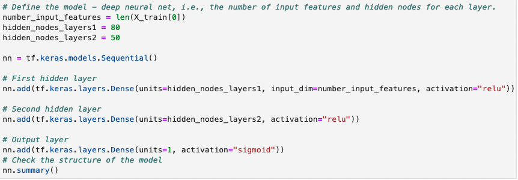
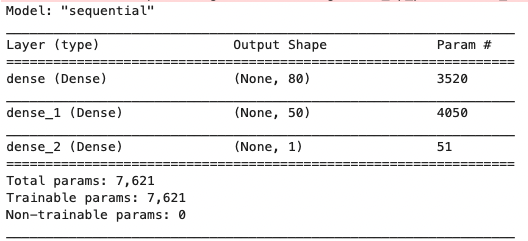
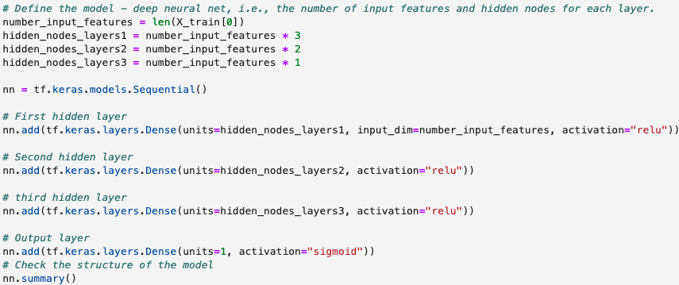
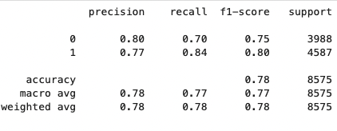

# Neural_Network_Charity_Analysis

# Background

Beks has come a long way since her first day at that boot camp five years ago—and since earlier this week, when she started learning about neural networks! Now, she is finally ready to put her skills to work to help the foundation predict where to make investments.

With your knowledge of machine learning and neural networks, you’ll use the features in the provided dataset to help Beks create a binary classifier that is capable of predicting whether applicants will be successful if funded by Alphabet Soup.

From Alphabet Soup’s business team, Beks received a CSV containing more than 34,000 organizations that have received funding from Alphabet Soup over the years. Within this dataset are a number of columns that capture metadata about each organization, such as the following:

    EIN and NAME—Identification columns
    APPLICATION_TYPE—Alphabet Soup application type
    AFFILIATION—Affiliated sector of industry
    CLASSIFICATION—Government organization classification
    USE_CASE—Use case for funding
    ORGANIZATION—Organization type
    STATUS—Active status    
    INCOME_AMT—Income classification
    SPECIAL_CONSIDERATIONS—Special consideration for application
    ASK_AMT—Funding amount requested
    IS_SUCCESSFUL—Was the money used effectively

# Deliverables 

**What You're Creating** 

This new assignment consists of three technical analysis deliverables and a written report. You will submit the following:

    Deliverable 1: Preprocessing Data for a Neural Network Model

    Deliverable 2: Compile, Train, and Evaluate the Model

    Deliverable 3: Optimize the Model
    
    Deliverable 4: A Written Report on the Neural Network Model (README.md)

    Overview of the analysis: Explain the purpose of this analysis.

# Results

**Data Preprocessing**

What variable(s) are considered the target(s) for your model?

* Module targeting variable is the "IS_SUCCESSFUL" column. 

What variable(s) are considered to be the features for your model?

* Each attemp is using every feature listed, but later on the optimization it will drop certain columns to refactor accuracy. 

What variable(s) are neither targets nor features, and should be removed from the input data?

* Initially "EIN" and "NAME" were dropped as we were instructed that these don't really affect much. 

**Compiling, Training, and Evaluating the Model**

How many neurons, layers, and activation functions did you select for your neural network model, and why?

* The first attempt it has 2 hidden layers with HiddenLayer1 having 80 neurons and HiddenLayer2 having. 

Were you able to achieve the target model performance?

* In this first attemp the target was 75% or above, but it was nowhere near this. 

What steps did you take to try and increase model performance?

* One of the things one was to add hidden layers. As well as, the activation type, the epoch quantity was changed, and the saving frequency. 

# Summary

 Summarize the overall results of the deep learning model. Include a recommendation for how a different model could solve this classification problem, and explain your recommendation.

The final model accuracy was around 57%. The reason being to the understanding of these models is the drop of the initial two columns that were thought to be not that impactful. It can be deduced that those two features are a big factor to the accuracy level of these models. However, the RandomForestAcccurcy was 0.778.

As it is learned that the more data there is available the more likely the accuracy level will be stronger. So a recommendation would be to just keep adding data, specially since some crucial features will be dropped. 
